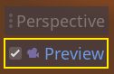

# Scène Player et actions d'entrée

Dans les deux prochaines leçons, nous allons concevoir la scène du joueur, enregistrer des actions d'entrée personnalisées, et coder le mouvement du joueur. À la fin, vous aurez un personnage jouable similaire à un subwaysurfer.

Le personage à un besoin d'un visuel, je vous fournit donc un model 3D que vous devrez importer dans Godot. Creez d'abord un dossiez Asset.

Ensuite il vous suffit de drag and drop le fichier depuis votre explorateur de fichier vers Godot.

***

> ## Note
> Les fichiers .glb contiennent des données de scènes 3D basées sur la spécification open-source GLTF 2.0. C'est une alternative moderne et puissante à un format propriétaire comme FBX, que Godot prend également en charge. Pour produire ces fichiers, nous avons conçu le modèle dans Blender 3D et l'avons exporté en GLTF.

***

Créez une nouvelle scène héritée en allant dans le menu Fichier en bas à gauche et en fesant un clique droit sur Charactere.glb.

Changez le type noeud Charactere en KynematicBody en fesant clique droit sur le noeud puis renomer le noeud en Player.

Les corps cinématiques sont complémentaires à la zone et aux corps rigides utilisés dans le tutoriel du jeu 2D. Comme les corps rigides, ils peuvent se déplacer et entrer en collision avec l'environnement, mais au lieu d'être contrôlés par le moteur physique, vous dictez leur mouvement. Vous verrez comment utiliser les fonctionnalités uniques du nœud quand nous coderons les mécaniques de saut et d'écrasement.

***

> ## Voir aussi
> Pour en savoir plus sur les différents types de nœuds de physique, consultez la page [Introduction à la physique](https://docs.godotengine.org/fr/stable/tutorials/physics/physics_introduction.html#doc-physics-introduction).

***

Comme avec tous les types de nœuds physiques, nous avons besoin d'une forme de collision pour que notre personnage puisse collisionner avec l'environnement. Sélectionnez le nœud Player à nouveau et ajoutez-lui un CollisionShape. Dans l'Inspecteur, assignez une BoxShape à la propriété Shape. L'armature de la sphère apparaît en dessous du personnage.

Il s'agira de la forme utilisée par le moteur physique pour collisionner avec l'environnement, nous voulons donc qu'elle s'adapte mieux au modèle 3D.Avant de modifier il faux changer l'etat de l'animation car notre player de va pas courrir dans cette position. Pour cela cliquez sur le noeud AnimationPlayer puis en bas au milieu selectionner l'animation run.

Enregistrez la scène sous le nom de Player.tscn.

Les nœuds étant prêts, nous pouvons presque commencer à coder. Mais d'abord, nous devons définir quelques actions d'entrée.

# Création d'actions d'entrée

Pour déplacer le personnage, nous écouterons l'entrée du joueur, comme l'appui sur les touches fléchées. Dans Godot, plutôt que d'écrire toutes les liaisons dans le code, il y a un système puissant qui nous permet d'attribuer une étiquette à un ensemble de touches et de boutons. Cela simplifie nos scripts et les rend plus lisibles.

Ce système est l'Input Map ("Contrôles" en français). Pour accéder à son éditeur, allez dans le menu Projet et sélectionnez Paramètres du projet....

En haut, il y a plusieurs onglets. Cliquez sur Contrôles. Cette fenêtre vous permet d'ajouter de nouvelles actions en haut ; ce sont vos étiquettes. Dans la partie inférieure, vous pouvez lier des clés à ces actions.

Les projets Godot viennent avec des actions prédéfinies conçues pour la conception d'interfaces utilisateur, que nous pourrions utiliser ici. Mais nous allons définir nos propres actions pour prendre en charge les manettes.

Nous allons nommer nos actions move_left, move_right, jump et slide.

Pour ajouter une action, écrivez son nom dans la barre en haut et appuyez sur Entrée.

Créez les cinq actions. Votre fenêtre devrait toutes les répertorier en bas.

Pour lier une touche ou un bouton à une action, cliquez sur le bouton "+" à sa droite. Faîtes-le pour move_left et dans le menu déroulant, cliquez sur Touche physique( une touche physique ignore le type de clavier comme QYERTY ou AZERTY).

Cette option vous permet d'ajouter une entrée clavier. Une fenêtre contextuelle apparaît et attend que vous appuyiez sur une touche. Appuyez sur la flèche de gauche et cliquez sur OK.

Faites de même pour la touche Q.

Faîtes de même pour les autres actions. Par exemple, liez la flèche de droite, D, et l'axe droit du joystick gauche à move_right. Après avoir lié toutes les touches, votre interface devrait ressembler à ceci.

Voilà toutes les actions dont nous avons besoin pour ce jeu. Vous pouvez utiliser ce menu pour étiqueter tout groupe de touches et de boutons dans vos projets.

Dans la partie suivante, nous allons coder et tester le mouvement du joueur.

[Suivant](https://github.com/copsfuraxx/ClubInfoTuto3D/tree/part3#d%C3%A9placer-le-joueur-avec-du-code)