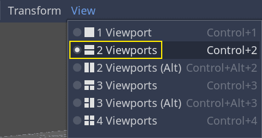

# Déplacer le joueur avec du code

C'est l'heure de coder ! Nous allons utiliser les actions que nous avons créées dans la partie précédente pour déplacer le personnage.

Faîtes un clic droit sur le nœud Player et sélectionnez Attacher un script pour lui ajouter un nouveau script. Dans la fenêtre contextuelle, mettez le Modèle à Empty avant d'appuyer sur le bouton Créer.


Commençons par les propriétés de la classe. Nous allons définir une vitesse de déplacement, une vitesse de chute et d'autre utile pour le deplacement du joueur.

***

## GDScript
 
```java
extends KinematicBody

export var speed = 10.0
export var fall_speed = 15.0
export var jump_speed = 15.0
export var swap_lane_speed = 15.0

var positions = [2.0, .0, -2.0]
var position = 1
var next_position = 1
var is_swap_lane = false
var is_jumping = false
var timer = .0
var jump_time = .5
```

***

***

> ## Note
> Les valeurs sont assez différentes du code 2D car les distances sont exprimées en mètres. En 2D, mille unités (pixels) peuvent ne correspondre qu'à la moitié de la largeur de votre écran, en 3D, c'est un kilomètre.

***

Codons le déplacement maintenant. Nous commençons par calculer le vecteur de direction en utilisant l'objet `Input` global, dans `_physics_process()`.

***

## GDScript

```java
func _physics_process(delta):
	var velocity = Vector3.ZERO
	velocity.z = speed
	
	if Input.is_action_just_pressed("jump") and not is_jumping:
		is_jumping = true
		timer = jump_time
		$AnimationPlayer.play("jump")
	
	if not is_swap_lane:
		if Input.is_action_pressed("move_right") and not Input.is_action_pressed("move_left") and position < 2:
			is_swap_lane = true
			next_position += 1
		if Input.is_action_pressed("move_left") and not Input.is_action_pressed("move_right") and position > 0:
			is_swap_lane = true
			next_position -= 1
	if is_swap_lane:
		if next_position < position:
			if translation.x + speed * delta > positions[next_position]:
				position = next_position
				is_swap_lane = false
			else:
				velocity.x = swap_lane_speed
		elif next_position > position:
			if translation.x - speed * delta < positions[next_position]:
				position = next_position
				is_swap_lane = false
			else:
				velocity.x = -swap_lane_speed
	if timer > .0:
		velocity.y = jump_speed
		timer -= delta
	else:
		velocity.y = -fall_speed
	velocity = move_and_slide(velocity, Vector3.UP)
	if is_on_floor():
		velocity.y = .0
		if is_jumping:
			is_jumping = false
            $AnimationPlayer.play("run")
	else:
		if not is_jumping:
			is_jumping = true
            $AnimationPlayer.play("fall")
```

***

Ici, nous allons faire tous nos calculs dans la fonction virtuelle `_physics_process()`. Comme `_process()`, cela nous permet de mettre à jour le nœud à chaque image, mais elle est conçue spécifiquement pour le code lié à la physique, comme le déplacement d'un corps cinématique ou rigide.

***

> ## Voir aussi
> Pour en savoir plus sur la différence entre `_process()` et `_physics_process()`, voir Traitement physique et traitement passif.

***

Pour l'animation de course initial vous devez rajouter

***

## GDScript

```java
func _ready():
	$AnimationPlayer.play("run")
```

***

# Tester le mouvement de notre joueur

Nous allons mettre notre joueur dans la scène Main pour le tester. Pour ce faire, nous devons instancier le joueur, puis ajouter une caméra. Contrairement à la 2D, en 3D, vous ne verrez rien si votre scène n'a pas de caméra pointant vers quelque chose.

Enregistrez votre scène Player et ouvrez la scène Main. Vous pouvez cliquer sur l'onglet Main en haut de l'éditeur pour le faire.

Si vous avez déjà fermé la scène, dirigez-vous vers le dock Système de fichiers et double-cliquez sur Maint.tscn pour la rouvrir.

Pour instancier le Player, faîtes un clic droit sur le nœud Main et sélectionnez Instancier une scène enfant.


Dans la fenêtre contextuelle, double-cliquez sur Player.tscn. Le personnage devrait apparaître au milieu de la fenêtre d'affichage.

# Ajout d'une caméra

Ajoutons ensuite la caméra. Faîtes un clic-droit sur le nœud Main à nouveau, mais sélectionnez Ajouter un nœud enfant cette fois. Sélectionnez.

Vous pouvez soit placer la camera sous Player pour qu'elle suive tout ces mouvement, soit rajoutez un petit script pour que la camera ne suive que l'avancé du Player. J'ai préféré la secode option.

***

## GDScript

```java
extends Camera

onready var j = get_node("../Player")
onready var dist = j.translation.z - translation.z

func _process(_delta):
	translation.z = j.translation.z - dist
```

***

Remarquez la case à cocher Aperçu qui apparaît en haut à gauche lorsque la Camera est sélectionnée. Vous pouvez cliquer dessus pour avoir un aperçu de la projection de la caméra dans le jeu.


Dans la barre d'outils juste au-dessus de la fenêtre d'affichage, cliquez sur Affichage, puis 2 vues. Vous pouvez également appuyer sur Ctrl + 2 (Cmd + 2 sur MacOS).



Dans le vue du bas, sélectionnez la Camera et activez l'aperçu de la caméra en cliquant sur la case à cocher.


Dans la vue du haut, déplacez la caméra d'environ -35 unités sur l'axe Z (le bleu) et 3 sur l'axe Y (le vert). N'oublier de tourner la camera vers le Player.


Vous pouvez lancer la scène en appuyant sur F6 et utiliser les touches fléchées pour déplacer le personnage.

***

# Bonus

Actuellement si vous utilisez les animations vous pouvez voir qu'il n'y a pas de transition entre les animation. Si vous souaitez les avoir recuperez le code de cette branche(nous ne verrons pas comment ca marche dans ce tuto)