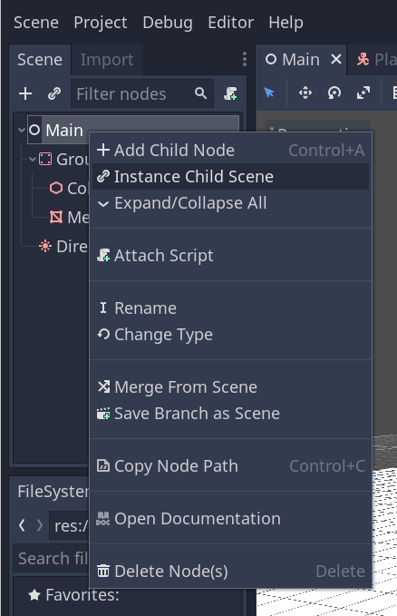

# Création du projet

Dans cette première partie, nous allons mettre en place la zone de jeu. Commençons par créer le projet et configurer la scène de jeu.

Créez le projet.

# Configuration de la zone jouable

Nous allons créer notre scène principale avec un simple Node comme racine. Dans le dock Scene, cliquez sur le bouton Ajouter un Nœud représenté par une icône "+" en haut à gauche et double-cliquez sur Node. Nommez le nœud "Main". Alternativement, pour ajouter un nœud à la scène, vous pouvez appuyer sur Ctrl + a (ou Cmd + a sur macOS).

Enregistrez la scène en tant que Main.tscn en appuyant sur Ctrl + s (Cmd + s sur MacOS).

Nous allons commencer par ajouter un sol qui va empêcher le perosnnage de tomber. Pour créer des collisionneurs statiques comme le sol, les murs, ou les plafonds, vous pouvez utiliser les nœuds StaticBody. Ils ont besoin de nœuds enfants pour définir la zone de collision. Avec le nœud Main sélectionné, ajoutez un nœud StaticBody, puis une CollisionShape. Renommez le StaticBody en Ground.

Une icône d'avertissement apparaît à côté de CollisionShape parce que nous n'avons pas défini sa forme. Si vous cliquez sur l'icône, une fenêtre contextuelle apparaît pour vous donner plus d'informations.

Pour créer une forme, avec le CollisionShape sélectionné, dirigez-vous vers l'Inspecteur et cliquez sur le champ [vide] à côté de la propriété Shape. Créez un nouveau Box Shape.

La forme de boîte est parfaite pour les sols plats et les murs. Son épaisseur la rend fiable même pour bloquer les objets qui se déplacent rapidement.

L'armature de la boîte apparaît dans la fenêtre avec trois points orange. Vous pouvez cliquer et faire glisser ces points pour modifier la taille de la forme interactivement. Nous pouvons également définir la taille précisément dans l'inspecteur. Cliquez sur la BoxShape pour étendre la ressource. Définissez ses Extents à 30 sur l'axe X, 1 sur l'axe Y, et 30 sur l'axe Z.

***

> ## Note
> En 3D, les unités de translation et de taille sont en mètres. La taille totale de la boîte est le double de ses étendues : 60 par 60 mètres sur le plan du sol et 2 unités de hauteur. Le plan du sol est défini par les axes X et Z, tandis que l'axe Y représente la hauteur.

***

Les formes de collision sont invisibles. Nous devons ajouter un sol visuel qui va avec. Sélectionnez le nœud Ground et ajoutez-lui un MeshInstance comme enfant.

Dans l'Inspecteur, cliquez sur le champ à côté de Mesh et créez une ressource CubeMesh pour créer un cube visible.

Une fois de plus, il est trop petit par défaut. Cliquez sur l'icône de cube pour étendre la ressource et définissez sa Size à 60, 2, et 60. Comme la ressource de cube fonctionne avec une taille plutôt que des étendues, nous devons utiliser ces valeurs pour qu'elles correspondent à notre forme de collision.

Vous devriez voir une large dalle grise qui couvre la grille et des axes bleus et rouges dans la fenêtre.

Nous allons déplacer le sol plus bas pour voir la grille du sol. Sélectionnez le nœud Ground, maintenez la touche Ctrl enfoncée pour activer l'accrochage à la grille (Cmd sur MacOS), puis cliquez et faîtes glisser vers le bas sur l'axe Y. C'est la flèche verte sur le gadget de déplacement.

***

> ## Note
> Si vous ne pouvez pas voir le manipulateur d'objets 3D comme sur l'image ci-dessus, assurez-vous que le Mode sélection est actif dans la barre d'outils au-dessus de la vue.

***

Déplacer le sol de 1 mètre vers le bas. Un message dans le coin en bas à gauche de la fenêtre vous indique de combien vous déplacez le nœud.

***

> ## Note
>Déplaer le nœud Ground vers le bas déplace ses deux enfants avec lui. Assurez-vous de déplacer le nœud Ground, pas le MeshInstance ni le CollisionShape.

***

Ajoutons une lumière directionnelle pour que notre scène ne soit pas toute grise. Sélectionnez le nœud Main et ajoutez-lui une DirectionalLight en enfant. Nous devons la déplacer et la pivoter. Déplacez-la vers le haut en faisant glisser la flèche verte du manipulateur et faîtes glisser l'arc rouge pour la faire tourner autour de l'axe X, jusqu'à ce que le sol soit éclairé.

Dans l'Inspecteur, activez Shadow -> Enabled en cochant la case.

À ce stade, votre projet devrait ressembler à ceci.

Voilà notre point de départ. Dans la prochaine partie, nous travaillerons sur la scène du joueur et le mouvement de base.